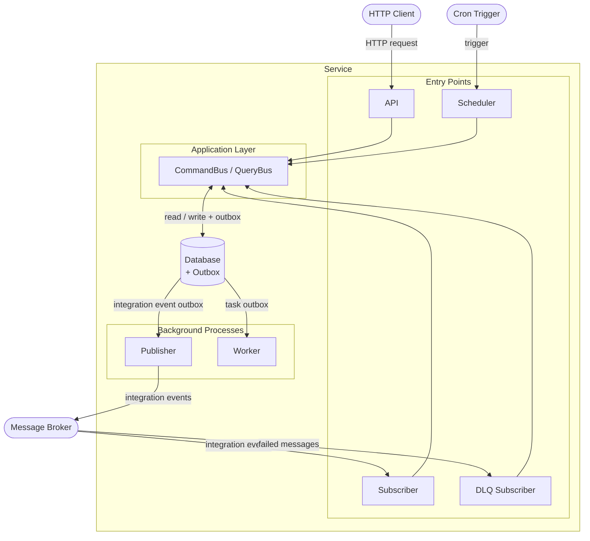
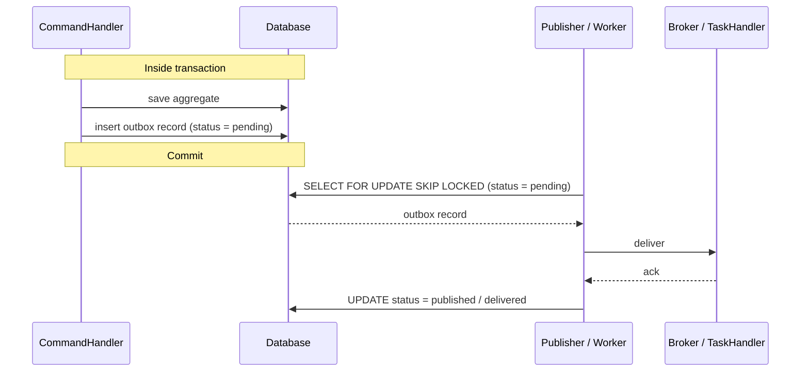

# Service Architecture — Building Blocks

> **Key points reference.** This document describes the standard building blocks of a service built on top of the seedwork packages. It is intentionally concise. For deeper context, see the [references](#references) at the end.

---

## 1. Service Anatomy

Not every service needs all seven blocks. Start with the API and the database. Add the remaining blocks only when the corresponding concern appears.



| Block              | Responsibility                                    | Required when                      |
| ------------------ | ------------------------------------------------- | ---------------------------------- |
| **API**            | HTTP entry point                                  | Always                             |
| **Database**       | Primary store + outbox tables                     | Always                             |
| **Subscriber**     | Consumes incoming integration events              | Service reacts to external events  |
| **DLQ Subscriber** | Processes failed subscriber messages              | Subscriber exists                  |
| **Publisher**      | Publishes outgoing integration events from outbox | Service emits integration events   |
| **Scheduler**      | Triggers cron jobs on a time schedule             | Service has periodic operations    |
| **Worker**         | Processes background tasks from outbox            | Service schedules background tasks |

---

## 2. The Building Blocks

### 2.1 API

The API is the **synchronous HTTP entry point**. Its only responsibility is to translate an HTTP request into a Command or Query, dispatch it through the bus, and map the result back to an HTTP response.

**Key points**

- Stateless. No business logic, no domain knowledge.
- Input validation happens inside the Command or Query constructor (`validate()`), not in the controller. Invalid commands throw `ValidationErrors` at `new` time — before they ever reach the bus.
- Dispatches to `CommandBus` for writes (returns `Result`) and `QueryBus` for reads (returns `Maybe`).
- Maps `Result.failed` → 4xx. Maps `Maybe.nothing()` → 404. Infrastructure exceptions → 5xx via a global error handler.

**Do**

- Keep controllers thin: parse → dispatch → map response.
- Let the bus stack handle validation, transactions, and domain event coordination.

**Don't**

- Put domain logic or repository calls in controllers.
- Return domain entities directly — map to DTOs at the response layer.

---

### 2.2 Database

The database is the **primary store and the outbox**. Both live in the same database, which is what makes the outbox guarantee possible.

**Key points**

- Aggregate tables and outbox tables are in the same database. The transaction that saves an aggregate also writes the outbox record — atomically.
- Two outbox tables with independent lifecycles: `integration_event_outbox` and `task_outbox`.
- The Unit of Work manages the transaction boundary. No transaction spans more than one command.
- The database is the single source of truth for both business state and pending deliveries.

**Do**

- Keep the outbox in the same database as the aggregates.
- Use separate outbox tables for integration events and background tasks.

**Don't**

- Write to the outbox outside of the command transaction.
- Share a transaction across multiple commands or aggregate roots.

---

### 2.3 Subscriber

The Subscriber **consumes incoming integration events from the message broker** and translates them into commands that the service can process.

**Key points**

- Maps each incoming integration event type to a Command and dispatches it through the `CommandBus`.
- Acknowledges the message to the broker **only after** successful processing (commit + no exception).
- On failure: does not acknowledge — the broker retries according to its retry policy.
- Must deduplicate by event ID. The same event may arrive more than once (at-least-once delivery).
- The subscriber is an infrastructure entry point — it is tightly coupled to the broker. It does not belong in the application or domain layers.

**Do**

- Dedup by event ID before dispatching the command (store processed IDs in the database).
- Log the correlation ID and causation ID from the incoming event.

**Don't**

- Put domain logic in the subscriber.
- Acknowledge before the command completes successfully.
- Let one subscriber handle unrelated integration event types from different bounded contexts.

---

### 2.4 DLQ Subscriber

The DLQ Subscriber **processes messages that exhausted all retry attempts** in the main subscriber.

**Key points**

- Reads from the Dead Letter Queue (or equivalent) of the broker.
- Typical actions: log for human inspection, trigger an alert, attempt a corrective command, or discard after recording.
- Do not blindly re-queue into the main queue — investigate the failure reason first. A business-rule failure (e.g. duplicate command, invalid state) will fail again regardless of retries.
- Separates the concern of failed-message handling from the main processing loop.

**Do**

- Distinguish between transient failures (safe to re-queue) and deterministic failures (require human intervention).
- Record the original event, failure reason, and attempt count for every DLQ message processed.

**Don't**

- Automatically re-queue all DLQ messages without inspection.
- Mix DLQ handling with the main subscriber logic.

---

### 2.5 Publisher

The Publisher **reads pending records from the integration event outbox and delivers them to the message broker**.

**Key points**

- Runs as an independent background process. It has no knowledge of the business operation that created the outbox records.
- Reads records with status `pending`, publishes to the broker, then marks them `published`.
- Never modifies business state — it only moves records through the outbox lifecycle.

**Delivery strategies**

| Strategy          | Mechanism                                                     | Latency        | Infrastructure overhead  |
| ----------------- | ------------------------------------------------------------- | -------------- | ------------------------ |
| **Polling**       | `SELECT … FOR UPDATE SKIP LOCKED` at a fixed interval         | Seconds        | None — works with any DB |
| **CDC**           | Reads WAL/binlog via Debezium Server or equivalent            | Milliseconds   | Requires CDC tooling     |
| **Hybrid**        | `pg_notify` / DB trigger as wake signal + polling as fallback | Near-real-time | Moderate                 |
| **Native stream** | DB-native change feed / listener (see below)                  | Milliseconds   | None — built into the DB |

Default to polling. Only add CDC or a native stream when polling latency is a demonstrated bottleneck.

> **Native change streams.** Several databases provide built-in mechanisms that eliminate the need for a separate polling loop or CDC tooling. When available, these are the lowest-overhead option:
>
> - **MongoDB** — Change Streams (`collection.watch()`): react to outbox inserts in real time, directly in application code.
> - **Firestore / Firebase** — `onWrite` Cloud Function triggers: the platform calls your code on every document change.
> - **Azure Cosmos DB** — Change Feed: a built-in, ordered stream of document changes consumable by a processor library.
> - **DynamoDB** — DynamoDB Streams + Lambda: captures item-level changes and invokes a function per record.
>
> In all cases the outbox table/collection still exists — the native stream is only the delivery mechanism that replaces the polling loop. The atomicity guarantee (outbox written in the same transaction as the aggregate) remains unchanged.

**Retry and re-publication**

- On broker failure: retry with exponential backoff. Do not mark the record as `failed` on the first attempt.
- After a configurable number of retries: mark as `failed` and alert. Do not discard.
- Failed records must be re-publishable by an operator without reprocessing the original command.
- Use `SKIP LOCKED` in polling queries to allow multiple Publisher instances without contention.

**Do**

- Run multiple Publisher instances for throughput — `SKIP LOCKED` handles concurrency safely.
- Monitor the outbox for records that remain `pending` beyond a threshold — it signals a Publisher failure.

**Don't**

- Delete outbox records immediately after publishing — retain them for a configurable period for auditability.
- Re-publish an already-published record. Use the `published` status check as a guard.

---

### 2.6 Scheduler

The Scheduler **triggers periodic operations on a time-based schedule (cron)**. It translates a cron tick into a Command dispatched through the `CommandBus`.

**Key points**

- Each scheduled job maps to one Command. The handler contains all the logic for that job.
- The Scheduler itself is stateless — it only fires the trigger. State lives in the aggregate and the database.
- Jobs must be idempotent. In distributed environments, multiple instances of the Scheduler may fire the same job concurrently. Use a distributed lock or a database-backed job record to prevent duplicate execution.
- Failures follow the same path as any command failure — `Result.failed` for domain errors, exceptions for infrastructure errors.

**Do**

- Design scheduled commands to be idempotent (safe to run twice).
- Use a distributed lock or a database-backed lease to prevent concurrent execution of the same job.

**Don't**

- Put business logic in the Scheduler. It fires a command — the handler and the domain do the work.
- Assume the Scheduler fires exactly once. It may fire zero times (missed schedule) or more than once (overlapping instances).

---

### 2.7 Worker

The Worker **reads pending records from the task outbox and executes them by calling the appropriate `TaskHandler`**.

**Key points**

- Mirrors the Publisher's structure but for internal background tasks instead of external integration events.
- Reads `TaskOutboxRecord` with status `pending`, calls the registered `TaskHandler`, marks as `delivered`.
- `TaskHandler` implementations belong to the same service and codebase. No broker involved.
- Handlers must be idempotent — at-least-once execution is the delivery guarantee.
- On handler failure: retry with exponential backoff. After max retries: mark as `failed` and alert.

**Execution strategies**

**Strategy A — In-process polling (default)**

The Worker polls the task outbox and calls the `TaskHandler` directly in the same process.

```
TaskOutbox (pending) → Worker (SKIP LOCKED) → TaskHandler → mark delivered
```

No extra infrastructure. The simplest option and the right default for most services.

**Strategy B — Delegated to an external task queue**

A relay process reads the task outbox and _publishes_ the task into the broker of an external task queue system (Redis, RabbitMQ, etc.). The task queue's own workers (Celery, BullMQ, Sidekiq, Laravel Horizon…) consume from that broker and invoke the `TaskHandler`.

```
TaskOutbox (pending) → Relay (SKIP LOCKED) → Task queue broker → Queue worker → TaskHandler → mark delivered
```

The relay is structurally identical to the Publisher — it reads from the outbox and publishes to a destination. The destination here is the task queue broker instead of the integration event broker.

The outbox record is marked `delivered` once the task queue broker **confirms the enqueue** — not when the `TaskHandler` finishes. From that point, the task queue system owns the task and is responsible for its own delivery guarantees, retries, and DLQ. This is the same contract as the Publisher with integration events: the outbox's responsibility ends when the destination confirms receipt.

Use Strategy B when you need features the simple polling loop cannot provide: advanced scheduling, priority queues, rate limiting, concurrency controls, or worker autoscaling.

> Do not bypass the outbox by publishing tasks directly into the queue from the command handler. The atomicity guarantee is lost if the service crashes after publishing but before committing the transaction.

**Do**

- Register one `TaskHandler` per task type.
- Design handlers to be idempotent by task ID.
- In Strategy B, treat the task queue as a delivery mechanism only — the outbox is the durable store.

**Don't**

- Use the Worker to communicate with other services — that is the Publisher's responsibility.
- Perform fire-and-forget work without going through the outbox. Tasks not recorded in the outbox are lost on crash.
- In Strategy B, wait for the `TaskHandler` to complete before marking `delivered` — the queue system owns execution from the moment of successful enqueue.

---

## 3. Infrastructure Mechanisms

### 3.1 Outbox Pattern

The outbox pattern **guarantees atomicity between a business state change and the intent to deliver an event or task**.



**Key points**

- The outbox record is written in the same transaction as the aggregate. Either both commit or neither does — no lost events.
- The Publisher/Worker process is separate and runs independently of the command execution.
- At-least-once delivery: if the Publisher crashes after delivering but before marking `published`, the record will be re-delivered on restart. Consumers must be idempotent.

---

### 3.2 Unit of Work

The Unit of Work defines the **transaction boundary for a single command execution**.

**What is inside the transaction**

- `Repository.save` — aggregate state persisted.
- `DomainEventBus.dispatch` — domain event handlers execute synchronously.
- `IntegrationEventPublisher.publish` — outbox record written.
- `TaskScheduler.schedule` — task outbox record written.

**What is outside the transaction**

- Actual broker delivery (Publisher process).
- Background task execution (Worker process).
- Read operations (`findById`, read repositories) — they participate in the transaction for consistency but do not require it for correctness.

**Do**

- Let `TransactionalCommandBus` manage the transaction transparently — handlers never call commit/rollback directly.

**Don't**

- Span a transaction across multiple commands.
- Open a transaction in a query handler.

---

### 3.3 Idempotency

**Every consumer of an at-least-once delivery channel must handle duplicates.**

This applies to: Subscriber (incoming integration events), Worker (background tasks), and any downstream consumer of integration events your service publishes.

**Standard deduplication pattern**

1. Before processing: check if the event/task ID exists in a `processed_events` table.
2. If found: acknowledge and return immediately (already processed).
3. If not found: process + insert the ID into `processed_events` in the same transaction.

**Key points**

- Use the event or task `id` as the deduplication key — it is a stable UUID generated at event creation time.
- The `processed_events` table can be pruned after a retention window (e.g. 30 days).
- Idempotency is the consumer's responsibility. Do not assume the producer will deduplicate.

**Do**

- Implement deduplication at the subscriber and worker level.
- Make `TaskHandler` implementations idempotent by design, even if the outbox already provides some protection.

**Don't**

- Rely on message broker deduplication guarantees — they vary by broker and configuration.
- Use the event `occurredAt` timestamp as a deduplication key — timestamps are not unique.

---

### 3.4 Retry and DLQ

**Not all failures are equal.** The retry strategy must distinguish between failure types.

| Failure type                                           | Origin         | Action                                                |
| ------------------------------------------------------ | -------------- | ----------------------------------------------------- |
| Transient (network, timeout, DB unavailable)           | Infrastructure | Retry with exponential backoff                        |
| Deterministic (business rule violation, invalid state) | Domain         | Do not retry — send to DLQ or discard                 |
| Poison message (malformed, unparseable)                | Data           | Send to DLQ immediately — retrying will never succeed |

**Retry policy**

- Use exponential backoff with jitter to avoid thundering herd on recovery.
- Set a maximum retry count per consumer. After exhaustion: route to DLQ.
- Log each retry attempt with the failure reason, attempt number, and correlation ID.

**Dead Letter Queue**

- The DLQ is the last resort, not a recycle bin. Investigate before re-queuing.
- Every DLQ message should trigger an alert.
- Maintain a re-queue mechanism for messages that are safe to retry after a fix is deployed.

**Do**

- Configure retry limits and DLQ routing explicitly for each subscriber.
- Treat DLQ messages as incidents that require investigation.

**Don't**

- Retry on `DomainError` — it is a deterministic failure.
- Leave DLQ messages unmonitored.

---

## 4. Observability

### 4.1 Motivation

A single user action can trigger a chain of commands, domain events, integration events, and background tasks across multiple processes and time boundaries. Without explicit traceability fields, reconstructing that chain after a failure is guesswork.

Two fields make the chain reconstructable:

- **`correlationId`** — the ID of the originating operation (typically the first HTTP request or incoming integration event). Constant throughout the entire chain. Answers: _what user action caused this?_
- **`causationId`** — the ID of the direct parent event, command, or task that caused this one. Changes at each step. Answers: _what immediately triggered this?_

### 4.2 Propagation Rules

```
HTTP Request (correlationId = X, causationId = X)
  └── Command dispatched
        └── DomainEvent emitted        (correlationId = X, causationId = command.id)
              └── IntegrationEvent published  (correlationId = X, causationId = domainEvent.id)
                    └── BackgroundTask scheduled  (correlationId = X, causationId = domainEvent.id)
```

**Rules**

- `correlationId` is **always** inherited from the parent — it never changes within a chain.
- `causationId` is the `id` of the immediate parent (the event, command, or task that triggered this one).
- If there is no parent (e.g. a cron job or a DLQ re-queue), generate a new `correlationId` and set `causationId` to the trigger ID.

### 4.3 Minimum Recommended Fields

Every integration event, background task, and structured log entry should carry:

| Field           | Type     | Description                                    |
| --------------- | -------- | ---------------------------------------------- |
| `id`            | UUID     | Unique identifier of this event/task/log entry |
| `correlationId` | UUID     | Originating operation identifier               |
| `causationId`   | UUID     | Direct parent identifier                       |
| `occurredAt`    | ISO-8601 | When the fact occurred                         |
| `type`          | string   | Event or task type discriminator               |
| `version`       | string   | Schema version (`"1"`, `"2"`)                  |
| `source`        | string   | Service that emitted this event                |

**Do**

- Propagate `correlationId` through every integration event, background task, and log statement in the chain.
- Use structured logging — log `correlationId` and `causationId` as indexed fields, not embedded in a message string.

**Don't**

- Generate a new `correlationId` mid-chain.
- Omit `causationId` — without it, the causal graph is incomplete.

---

## 5. References

- Evans, E. (2003). _Domain-Driven Design: Tackling Complexity in the Heart of Software_. Addison-Wesley.
- Richardson, C. (2018). _Microservices Patterns_. Manning. _(Outbox pattern, Saga, CQRS)_
- Hohpe, G. & Woolf, B. (2003). _Enterprise Integration Patterns_. Addison-Wesley.
- Kleppmann, M. (2017). _Designing Data-Intensive Applications_. O'Reilly. _(CDC, at-least-once delivery, idempotency)_
- Stopford, B. (2018). _Designing Event-Driven Systems_. O'Reilly.
