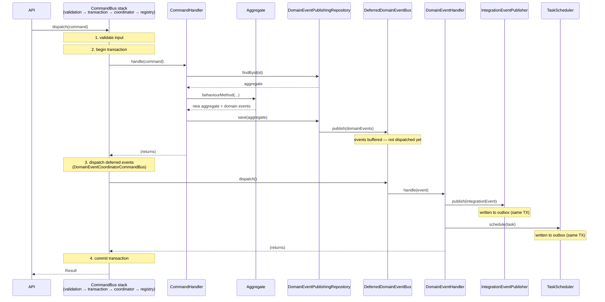
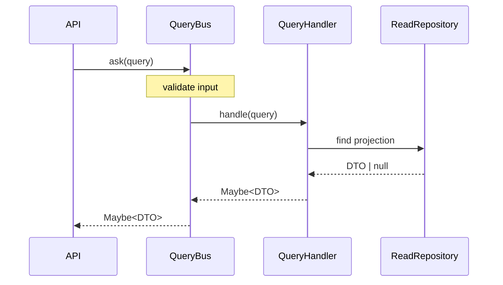

# Best Practices — DDD & Hexagonal Architecture

> **Key points reference.** This document summarises the design rules and principles behind the seedwork packages. It is intentionally concise — each section captures the essential constraints. For deeper context, see the [references](#references) at the end.

---

## 1. Hexagonal Architecture — Fundamental Rules

The dependency rule is the single constraint that everything else follows from:

```
Domain ← Application ← Infrastructure
```

- **Domain layer** — pure business logic. No framework, no database, no HTTP. Depends on nothing outside itself.
- **Application layer** — orchestration and use cases. Depends on domain types and abstract ports (interfaces/protocols). No concrete infrastructure.
- **Infrastructure layer** — implements ports. Depends inward. Never imported by domain or application.

**Ports are owned by the inner layer.** A port is an interface or protocol defined in domain or application. The adapter that implements it lives in infrastructure. The inner layer dictates the contract; the outer layer conforms.

**Do**

- Keep the dependency arrow always pointing inward.
- Define ports in the layer that needs them, not the layer that implements them.

**Don't**

- Import infrastructure types from application or domain.
- Let framework annotations or database types leak into domain objects.

---

## 2. Domain Components

### 2.1 Entity

An entity has **identity**. Two entity instances with the same ID are the same entity regardless of their other fields. Equality is identity-based, not structural.

**Key points**

- Identity is established at construction and never changes.
- State changes only through explicit behaviour methods — no public setters.
- Behaviour methods return new instances (immutability). They never mutate `this`/`self`.
- Invariants are enforced in the constructor and behaviour methods. Invalid state must be impossible to construct.

**Do**

- Model meaningful domain operations as named methods (`confirm()`, `suspend()`, `assign()`).
- Throw a `DomainError` subclass when an invariant is violated.

**Don't**

- Expose setters or public mutable fields.
- Put orchestration or persistence logic inside an entity.

---

### 2.2 Value Object

A value object has **no identity**. Two instances with the same field values are equal. They are always immutable.

**Key points**

- Equality is structural (all fields must match).
- Validated at construction — a value object is either valid or it cannot exist.
- Replaces primitive obsession: prefer `Money`, `Email`, `DateRange` over raw scalars.
- Self-contained: carries its own validation and behaviour (e.g. `Money.add(other)`).

**Do**

- Use value objects for any concept defined entirely by its attributes.
- Validate inside the constructor — throw `DomainError` on invalid input.

**Don't**

- Use a value object for a concept that needs to be tracked over time — that is an entity.
- Share mutable state between value objects.

---

### 2.3 Aggregate

An aggregate is a **consistency boundary**. It groups one or more entities and value objects under a single root (the aggregate root) that enforces all invariants that span the group.

**Key points**

- The aggregate root is the only entry point. External code never modifies inner entities directly.
- All state changes go through behaviour methods on the root.
- Reference other aggregates by ID only — never hold object references across aggregate boundaries.
- Behaviour methods return new instances and append domain events.
- Keep aggregates small. A large aggregate with many inner entities is almost always a sign of a missing bounded context boundary.

**Do**

- Design the aggregate around the business invariants it must enforce.
- Use `reconstitute` (or equivalent) static factory when loading from persistence — no events.

**Don't**

- Put infrastructure or application logic inside the aggregate.
- Let an aggregate grow to cover unrelated concepts — split it.

---

### 2.4 Domain Event

A domain event is an **immutable fact** that something meaningful happened within the domain.

**Key points**

- Named in past tense, using business language: `OrderConfirmed`, `PaymentProcessed`, `CustomerUpgradedToPremium`.
- Emitted by the aggregate root after a state change.
- Payload contains primitives only — no value object instances, no aggregate references.
- Processed **synchronously within the same transaction**. Domain event handlers run before the transaction commits.
- Scope: in-process, same bounded context.

**Do**

- Apply the business-language test: would a non-technical stakeholder understand this event name without explanation?
- Keep payloads minimal and serializable.

**Don't**

- Name events after technical operations (`UserUpdated`, `RecordCreated`).
- Use domain events to communicate across bounded context boundaries — use integration events for that.
- Embed value objects or entities in the payload.

---

### 2.5 Domain Service

A domain service encapsulates **domain logic that does not naturally belong to a single aggregate or value object**.

**Key points**

- Stateless — no mutable fields, no persistence.
- Operates on domain objects passed to it as arguments.
- Justified when: the logic involves multiple aggregates, or requires a read from a domain port to make a domain decision.
- Should be rare. If most of your logic lives in services rather than aggregates, you have an anemic domain model.

**Do**

- Keep domain services slim and focused on a single coordination concern.
- Name them after the domain concept they represent, not the operation (`PricingPolicy`, `TransferAuthority`).

**Don't**

- Use domain services as a dumping ground for logic that belongs in aggregates.
- Inject infrastructure adapters into a domain service — use ports.
- Make domain services stateful.

---

### 2.6 Repository

A repository is the **outbound domain port for aggregate persistence**. It abstracts the storage mechanism behind a collection-like interface.

**Key points**

- Only identity-based operations: `findById`, `save`, `deleteById`.
- Returns full domain aggregates — not DTOs, not raw rows.
- One repository per aggregate root.
- The interface is defined in the domain layer; the implementation lives in infrastructure.

**Do**

- Keep the repository interface minimal — only what the domain actually needs.
- Return `null`/`None` (or `Maybe`) from `findById` when not found — let the caller decide.

**Don't**

- Add query methods to the domain repository (`findByEmail`, `findByStatus`). Use a separate read repository in the application layer.
- Implement business logic inside the repository.
- Let the repository return partial aggregates or raw data structures.

---

### 2.7 Domain Ports (Outbound)

Domain ports are **abstract interfaces owned by the domain or application layer** that allow inner layers to interact with the outside world without depending on it.

**Key points**

- Defined in the layer that needs them (domain or application). Implemented in infrastructure.
- **Read ports** — no side effects. Can be called outside of a transaction. Examples: ACL adapters that query external services, read repositories.
- **Write ports** — have side effects. Must participate in the transaction if they mutate state. Examples: `Repository.save`, `IntegrationEventPublisher` (via outbox), `TaskScheduler` (via outbox).
- The Anti-Corruption Layer (ACL) pattern translates external models into domain models at the port boundary. The adapter calls the external service; a parser maps the response to domain types.

**Do**

- Define ports at the granularity of a single concern.
- Use ACL parsers to isolate external model changes from the domain.

**Don't**

- Mix read and write responsibilities in a single port.
- Let external data structures cross the port boundary into the domain.

---

## 3. Application Components

### 3.1 Command and CommandHandler

A command expresses **intent to change state**. The handler orchestrates the operation.

**Key points**

- One command per write use case.
- Commands carry the data needed to perform the operation and validate their own input.
- The handler's responsibility is orchestration only: load aggregate → call domain method → save. No business logic in handlers.
- The handler returns nothing — outcome is communicated via `Result` by the command bus.

**Do**

- Keep handlers thin. If a handler contains conditionals over domain state, that logic probably belongs in the aggregate.

**Don't**

- Put business rules in the handler.
- Return data from a command handler — use a query for that.

---

### 3.2 Query and QueryHandler

A query is a **request for data with no side effects**.

**Key points**

- Returns `Maybe<TResult>` — either a result or nothing.
- Query handlers are strictly read-only. No state changes, no command dispatching.
- Use **read repositories** (ad-hoc ports defined in the application layer), not the domain repository. The domain repository loads full aggregates; queries often need projections.
- Returns DTOs (plain data objects with primitive fields) — never domain entities.

**Do**

- Define a dedicated read port per query when the projection differs from the aggregate.
- Return `nothing()` for both not-found and unauthorized — do not reveal resource existence to unauthorized callers.

**Don't**

- Load a full aggregate in a query handler just to extract two fields.
- Dispatch commands or trigger side effects from a query handler.
- Return domain aggregates as query results.

---

### 3.3 Unit of Work

The Unit of Work defines the **transaction boundary** for a command execution.

**Key points**

- Wraps the entire command handler execution: aggregate load, domain method call, save, domain event dispatch — all inside one transaction.
- On commit: all changes persist and domain event handlers execute.
- On rollback: no state persisted, no events published.
- The transaction boundary is the command. Never let a transaction span multiple commands.

**Do**

- Use `TransactionalCommandBus` to apply the Unit of Work transparently — handlers never see it.
- Ensure domain event handlers run inside the same transaction.

**Don't**

- Open a transaction manually in a handler.
- Span a transaction across multiple aggregate roots or multiple commands.

---

### 3.4 Application Ports (Outbound)

Two outbound ports at the application layer manage **eventual side effects**:

**`IntegrationEventPublisher`**

- Publishes integration events to external consumers via the outbox pattern.
- The publish call writes to the outbox **inside the current transaction**. Actual delivery to the broker happens after commit, asynchronously.
- The application layer depends on the interface; infrastructure provides the outbox-backed implementation.

**`TaskScheduler`**

- Schedules background tasks for the same service via the outbox pattern.
- Same transactional guarantee: scheduling writes to the outbox inside the transaction.

**Key points**

- Both ports are write ports but their delivery is eventual — they do not block the command response.
- Transactional atomicity is guaranteed by the outbox: either the aggregate saves and the outbox record is written, or neither happens.
- The application layer is agnostic to the delivery mechanism (broker, worker queue, etc.).

**Do**

- Call `IntegrationEventPublisher.publish` and `TaskScheduler.schedule` from command handlers or domain event handlers — never from the domain layer.

**Don't**

- Assume synchronous delivery.
- Publish directly to a broker from a handler — always go through the port.

---

### 3.5 Result

`Result` is the **value-based error contract for commands**.

**Key points**

- Two states: `ok()` (success) and `failed(errors)` (failure with a list of `ResultError`).
- `ResultError` carries a `code` (machine-readable) and a `description` (human-readable).
- The command bus catches `DomainError` thrown by handlers and converts them to `Result.failed`. Handlers never return `Result` directly.
- Infrastructure failures (timeouts, connection drops) propagate as exceptions — they are not wrapped in `Result`.

**Do**

- Inspect `Result` at the entry point (controller, API handler) to decide the HTTP response.
- Use error `code` values for programmatic branching; use `description` for logging and user messages.

**Don't**

- Throw `DomainError` and catch it in the handler — let the bus handle the conversion.
- Wrap infrastructure exceptions in `Result`.

---

### 3.6 Maybe

`Maybe` is the **value-based absence contract for queries**.

**Key points**

- Two states: `just(value)` (found) and `nothing()` (absent).
- Replaces `null`/`None` returns with an explicit type that forces the caller to handle absence.
- Use `nothing()` for both not-found and unauthorized — identical response, no information leak.

**Do**

- Check `isNothing()` at the entry point before accessing the value.

**Don't**

- Use `Maybe` for command results — that is `Result`'s responsibility.
- Use `just(null)` — if the value is absent, return `nothing()`.

---

### 3.7 Error Handling

| Error type               | Origin                       | Handling                                |
| ------------------------ | ---------------------------- | --------------------------------------- |
| `DomainError`            | Aggregate / domain service   | Caught by command bus → `Result.failed` |
| `ValidationErrors`       | Command / Query `validate()` | Thrown before the handler executes      |
| Infrastructure exception | Repository, external adapter | Propagates — do not catch or wrap       |

**Key points**

- The entry point (controller) only needs to handle `Result` for domain failures and `ValidationErrors` for input failures. It never catches `DomainError`.
- Infrastructure exceptions bubble up to a global error handler.
- Never use exceptions for flow control within the domain — that is what `DomainError` → `Result` is for.

**Do**

- Define a `DomainError` subclass for each distinct business rule violation with a stable `code`.

**Don't**

- Catch `DomainError` in handlers.
- Return `Result.failed` for infrastructure failures.
- Use generic exception types for domain errors.

---

### 3.8 Operation Flows

#### Write operation



#### Read operation



---

## 4. Domain Events · Integration Events · Background Tasks

This is the most consequential design decision in a service. Using the wrong mechanism introduces either excessive coupling or unnecessary complexity.

### 4.1 Domain Event

A domain event is an **in-process fact within the same bounded context**.

|                 |                                                   |
| --------------- | ------------------------------------------------- |
| **Scope**       | In-process, same bounded context                  |
| **Consistency** | Strong — synchronous, within the same transaction |
| **Delivery**    | Guaranteed — in-process method call               |
| **Audience**    | Other aggregates within the same bounded context  |

**Key points**

- Processed by `DomainEventHandler` implementations registered on the `DomainEventBus`.
- Handlers run within the same transaction as the command — if the transaction rolls back, handlers did not execute.
- The `DomainEventPublishingRepository` decorator publishes events automatically after `save`. Handlers are unaware of the publishing mechanism.
- The deferred bus (`DeferredDomainEventBus`) buffers events and dispatches them after the command handler completes but before the transaction commits. Idempotent by event ID — saving the same aggregate twice in one transaction does not duplicate events.

**Do**

- Use domain events for intra-bounded-context reactions: updating a read model, enforcing a cross-aggregate invariant reactively, triggering a follow-up operation within the same service.

**Don't**

- Use domain events to notify other services or bounded contexts.
- Perform I/O with side effects outside the transaction in a domain event handler.

---

### 4.2 Integration Event

An integration event is a **public notification that something relevant happened**, intended for consumers outside the bounded context.

|                 |                                               |
| --------------- | --------------------------------------------- |
| **Scope**       | Cross-service, cross-bounded-context          |
| **Consistency** | Eventual — outbox + message broker            |
| **Delivery**    | At-least-once (idempotent consumers required) |
| **Audience**    | Other services / bounded contexts             |

**Key points**

- Published via `IntegrationEventPublisher`. The outbox pattern guarantees atomicity: the event record is written in the same transaction as the aggregate.
- Carries `type`, `version`, `correlationId`, and optionally `causationId`. These fields are mandatory because integration events are a **public, versioned contract**.
- Schema evolution: add optional fields (backwards-compatible). Never rename, remove, or change the type of existing fields.
- Consumers must be idempotent — at-least-once delivery is the default guarantee of any message broker.

**Do**

- Publish integration events from domain event handlers (reacting to a domain fact).
- Version integration events from day one. Even `v1` is a version.
- Include `correlationId` from the originating command.

**Don't**

- Assume that publishing an integration event means the consumer received it immediately.
- Change the schema of a published integration event without introducing a new version.
- Use integration events for work that stays within the same service — use a background task instead.

---

### 4.3 Background Task

A background task is **deferred work within the same service**.

|                 |                                              |
| --------------- | -------------------------------------------- |
| **Scope**       | Same service                                 |
| **Consistency** | Eventual — outbox + internal worker          |
| **Delivery**    | At-least-once (idempotent handlers required) |
| **Audience**    | A `TaskHandler` within the same service      |

**Key points**

- Scheduled via `TaskScheduler`. Like `IntegrationEventPublisher`, it writes to the outbox inside the transaction.
- Use for: long-running operations, retryable work, resource-intensive processing, or anything that should not block the command response.
- The key distinction from integration events: a background task stays within the service and is processed by a `TaskHandler` in the same codebase. No external consumer.
- Handlers must be idempotent — the worker may deliver the task more than once.

**Do**

- Include `correlationId` (and `causationId` when applicable) in every task.
- Design `TaskHandler` implementations to be idempotent by task ID.

**Don't**

- Use background tasks to communicate with other services — that is an integration event.
- Perform fire-and-forget work without the outbox guarantee — if the service crashes between scheduling and execution, the task would be lost.

---

### 4.4 Decision Guide

```
Did something meaningful happen in the domain?
└── YES → Emit a Domain Event
    │
    ├── Does another bounded context need to know?
    │   └── YES → Also publish an Integration Event
    │              (from a DomainEventHandler)
    │
    └── Does work need to happen asynchronously within this service?
        └── YES → Schedule a Background Task
                   (from a DomainEventHandler)
```

**Concrete examples**

| Scenario                                         | Mechanism         |
| ------------------------------------------------ | ----------------- |
| Order confirmed → update order read model        | Domain Event      |
| Order confirmed → notify shipping service        | Integration Event |
| Order confirmed → generate PDF invoice (slow)    | Background Task   |
| Payment processed → update account balance       | Domain Event      |
| Payment processed → notify customer service      | Integration Event |
| User registered → send welcome email (retryable) | Background Task   |

---

### 4.5 Cross-cutting Concerns

**Naming** — all three use past tense and business language. The name must be meaningful to a non-technical stakeholder without explanation.

**Idempotency** — at-least-once delivery is the default. Every domain event handler, integration event consumer, and task handler must handle duplicates. Use the event/task `id` as the deduplication key.

**Traceability** — propagate `correlationId` from the originating command through every downstream event and task. Use `causationId` to record the ID of the event or command that directly caused this one. These two fields are what make distributed traces reconstructable.

---

## 5. References

- Evans, E. (2003). _Domain-Driven Design: Tackling Complexity in the Heart of Software_. Addison-Wesley. [1]
- Vernon, V. (2013). _Implementing Domain-Driven Design_. Addison-Wesley. [2]
- Robert C. Martin, _Clean Architecture: A Craftsman's Guide to Software Structure and Design_ [3]
- .NET Microservices: _Architecture for Containerized .NET Applications_ [4]
- Harry Percival & Bob Gregory, _Architecture Patterns with Python_ [5]
- Cockburn, A. (2005). _Hexagonal Architecture_. [6]

[1]: https://www.amazon.es/Domain-Driven-Design-Tackling-Complexity-Software/dp/0321125215
[2]: https://www.amazon.es/Implementing-Domain-Driven-Design-Vaughn-Vernon/dp/0321834577
[3]: https://www.amazon.es/Clean-Architecture-Craftsmans-Software-Structure/dp/0134494164
[4]: https://learn.microsoft.com/en-us/dotnet/architecture/microservices/
[5]: https://www.oreilly.com/library/view/architecture-patterns-with/9781492052197/
[6]: https://alistair.cockburn.us/hexagonal-architecture/
